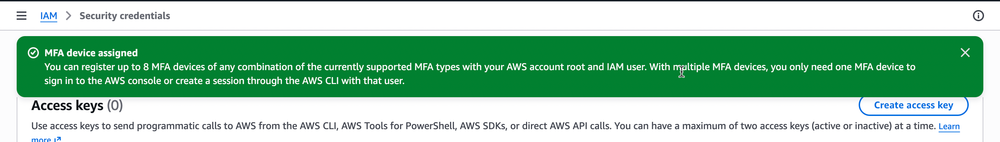
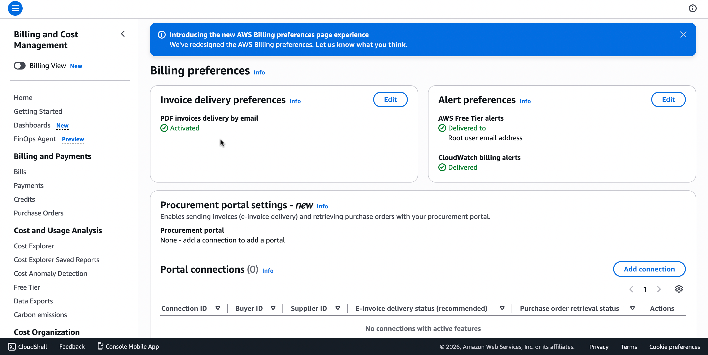
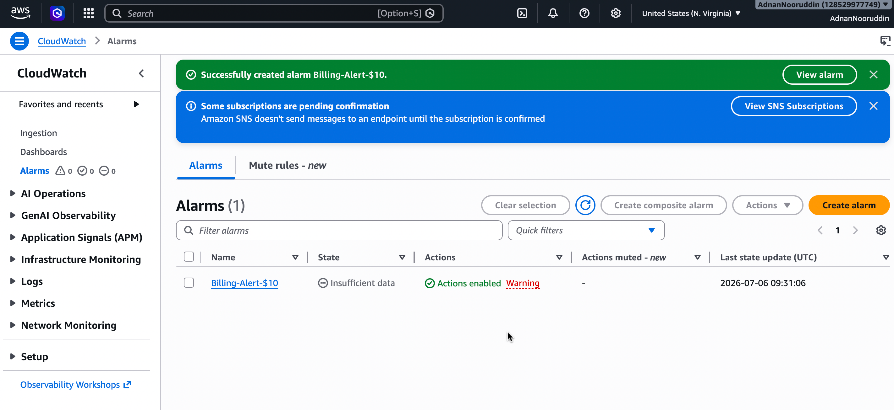
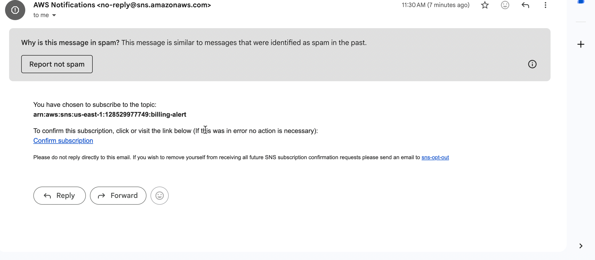
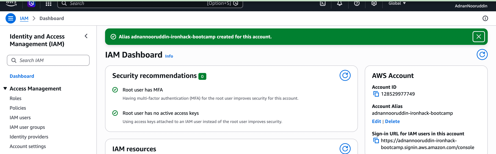
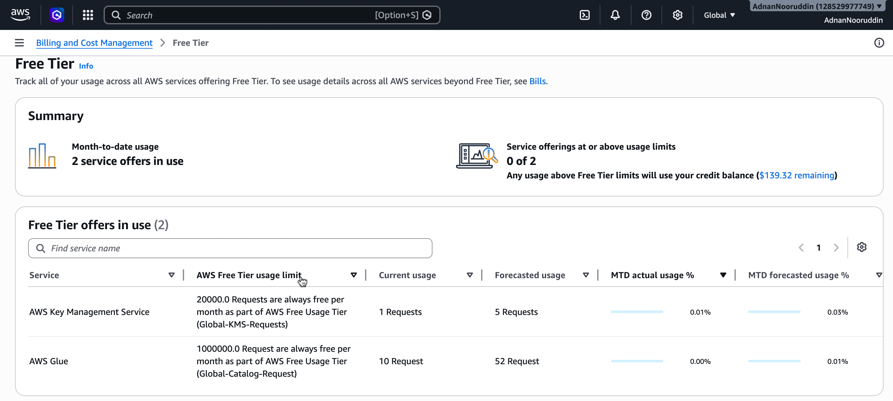
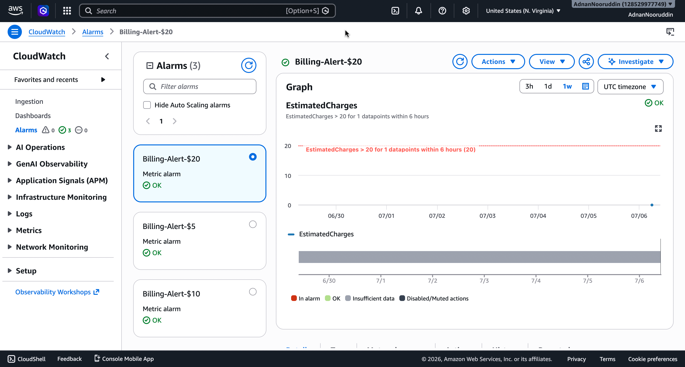

# AWS Account Setup Lab - Solution

**Student Name:** Adnan Nooruddin  
**Date Completed:** 06-07-2026

---

## Exercise 1: MFA Configuration

### Screenshot:

### Notes:
- Authenticator app used: Google Authenticator
- MFA setup completed successfully: Yes
- Backup codes saved: No 

---

## Exercise 2: Billing Alerts

### Screenshots:

**Billing Preferences:**

**Billing Alarm:**

**SNS Confirmation:**

### Configuration Details:
- Alert threshold: $10
- Email confirmed: Yes 
- Additional thresholds created (bonus): Yes if yes, 5$, 20$

---

## Exercise 3: Account Alias

### Screenshot:

### Account Details:
- **Account Alias:** adnannooruddin-ironhack-bootcamp
- **Sign-In URL:** `https://adnannooruddin-ironhack-bootcamp.signin.aws.amazon.com/console`
- **Tested successfully:** No

---

## Exercise 4: Free Tier Dashboard

### Screenshot:

### Current Free Tier Usage Summary:

| Service | Current Usage | Free Tier Limit | Status |
|---------|--------------|-----------------|--------|
| AWS Key Management Service | 1 requests | 20000.0 Requests/month | - |
| AWS Glue | 10 requests |  10000.0 Requests/month  | - |

### Notes:
- Any services approaching limits? No 
- Any unexpected usage? No 

---

## Exercise 5: Reflection Questions

### 1. Why is MFA important even for a personal learning account?

**Your Answer:**
MFA is very important because it adds extra layer of security to the account. without MFA it is very difficult for hacker to access the account. if someone access the account. it can create services which will cost more and can easily make other services and systems down as well.

---

### 2. What would happen if you left your root user unprotected?

**Your Answer:**
root user has all the access of the account. if attacker gets the access of the root account then he can break the whole infrastructure.

---

### 3. How do billing alerts help prevent unexpected charges?

**Your Answer:**
every unnecessary changes has to be notified. create correct alerts, alarm and billing management. proactive monitoring is important because it will help us to react quickly if something goes wrong

---

### 4. What threshold did you set for your billing alert and why?

**Your Answer:**
[Write your answer here. Explain: Why did you choose this amount? Is it appropriate for your usage? Would you set multiple thresholds?]
I have set this amount for testing purpose and I donot want it to learn how it works. yes I have set multiple thresholds.

---

### 5. What is your account alias and why did you choose it?

**Your Answer:**
- **Alias:** adnannoorudddin-ironhack-bootcamp
- **Reasoning:** I choose that because it is meaning full and easy to remember and have reason behind it.

---

### 6. What services are you currently using according to the Free Tier dashboard?

**Your Answer:**
AWS Key Management Service
AWS Glue

---

## Bonus Challenges Completed (Optional)

### Challenge 1: Multiple Billing Alert Thresholds

- [ ] $5 threshold
- [ ] $20 threshold

**Screenshots (if completed):**

---

### Challenge 2: CloudTrail Enabled

- [ ] CloudTrail enabled
- [ ] Logging to S3 configured

**Notes:**
[Add any notes about CloudTrail setup]

---

### Challenge 3: AWS Trusted Advisor Reviewed

- [ ] Accessed Trusted Advisor
- [ ] Reviewed recommendations

**Key recommendations found:**
[List any recommendations you found]

---

## Lessons Learned

**What was the most challenging part of this lab?**

creating the alarm and selecting the metric

---

**What would you do differently next time?**

[Your answer]

---

**What security practices will you implement going forward?**

I would like to implement alerts on costs and user management and make it more secure.

---

## Checklist Before Submission

- [ ] All required screenshots captured and saved
- [ ] Screenshots are clear and show relevant information
- [ ] All reflection questions answered thoroughly
- [ ] Account alias documented
- [ ] Free Tier usage documented
- [ ] Work committed to Git
- [ ] Pull request created
- [ ] PR URL submitted to Student Portal

---

**Lab Completed By:** Adnan Nooruddin  
**Date:** 06.07.2026
